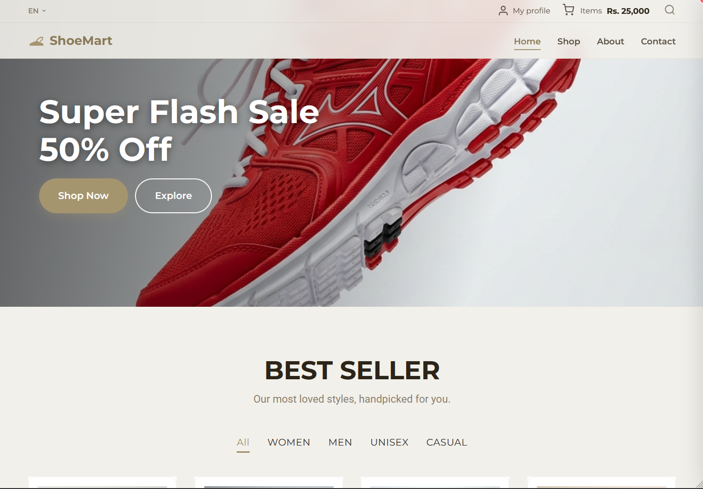
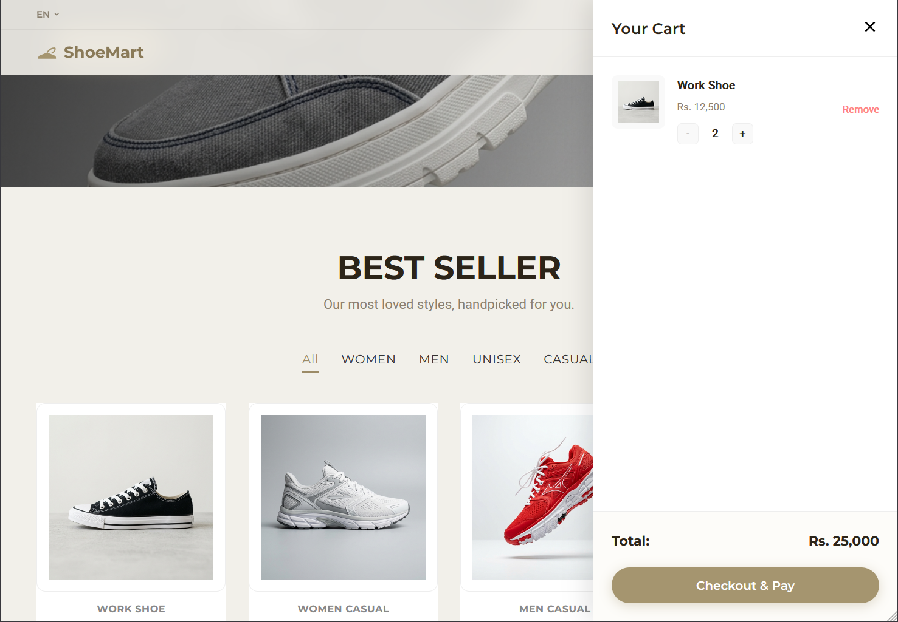
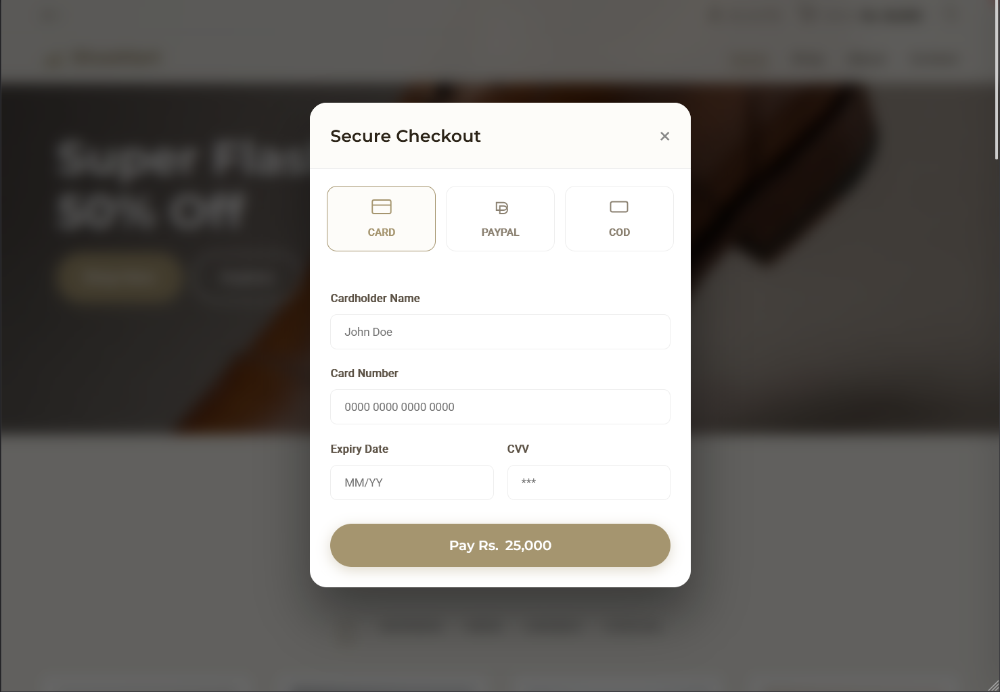
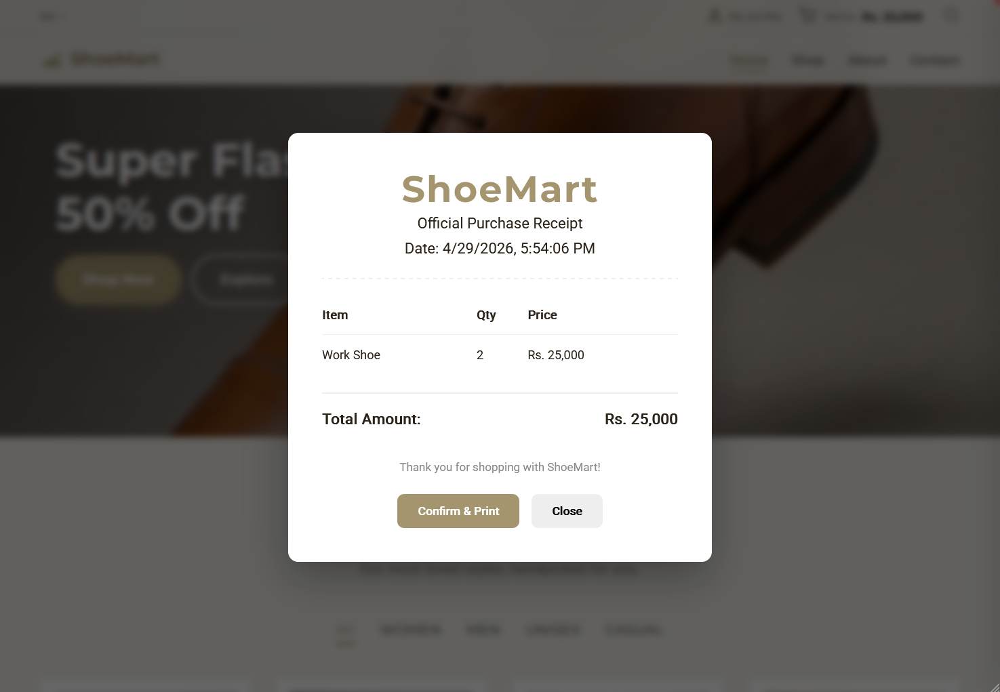

# ShoeMart - Premium Responsive E-Commerce Storefront

<p align="center">
  <a href="https://skillicons.dev">
    
  </a>
</p>

ShoeMart is a modern, high-end, and fully responsive e-commerce storefront dedicated to premium footwear. Built with a focus on visual excellence and smooth user experience, it features a robust shopping cart system, simulated secure checkout, and dynamic product management.

## ✨ Key Features

- **🛍️ Dynamic Shopping Cart:** Persistent cart management using `sessionStorage` with real-time total calculations and quantity controls.
- **💳 Simulated Secure Checkout:** Multi-method payment gateway (Card, PayPal, COD) with realistic processing states and validation.
- **📄 Professional Receipt System:** Generates a printable purchase receipt upon successful transaction, including itemized breakdown and order details.
- **📱 Fully Responsive Design:** Mobile-first architecture ensuring a seamless experience across desktops, tablets, and smartphones.
- **🔍 Advanced UI Components:**
  - Interactive Hero Slider with "Super Flash Sale" banners.
  - Search overlay with auto-focus and simulated search logic.
  - Category-based product filtering (Men, Women, Unisex, Casual).
  - "Load More" functionality for seamless catalog browsing.
- **🪄 Premium Aesthetics:**
  - Modern typography using Google Fonts (Montserrat & Roboto).
  - Smooth micro-animations and scroll-reveal effects using `IntersectionObserver`.
  - Glassmorphic UI elements and curated color palettes.
- **🔔 Real-time Feedback:** Integrated toast notification system for user actions (Add to cart, payment success, etc.).

## UI Design

- **Wireframe:** [Link](https://www.figma.com/design/LfdDWSsMt1jD9C12VVddcm/shoe-mart-wireframe?node-id=0-1&t=znGDPfqtOCDt8k1o-1)
- **UI Design:** [Link](https://www.figma.com/design/0Ld8sGnpIi7zQ7OpJQlBYC/shoe-mart-visual-design?node-id=0-1&t=EWcdxbFIQxx58K56-1)

## 🚀 Technologies Used

- **Frontend:** HTML5, CSS3 (Flexbox & CSS Grid), Vanilla JavaScript (ES6+)
- **Icons:** Custom SVG iconography
- **Fonts:** [Montserrat](https://fonts.google.com/specimen/Montserrat) & [Roboto](https://fonts.google.com/specimen/Roboto)
- **Deployment Ready:** Clean, semantic code optimized for performance and accessibility (WCAG compliant).

## 📂 Project Structure

```text
/
├── index.html          # Main application entry point
├── assets/
│   ├── css/
│   │   └── style.css   # Core design system and component styles
│   ├── js/
│   │   └── main.js    # Application logic, cart management, and UI interactions
│   └── images/         # Optimized product and UI assets
└── README.md           # Project documentation
```

## 🛠️ Getting Started

1. **Clone the repository:**
   ```bash
   git clone https://github.com/rishinduyohan/shoe-mart-responsive-web.git
   ```
2. **Open the project:**
   Simply open `index.html` in any modern web browser to view the application.

## 📸 Screenshots

### 🏠 Home & Hero Section


### 🛒 Product Catalog & Shopping Cart



### 💳 Secure Checkout & Receipt



---